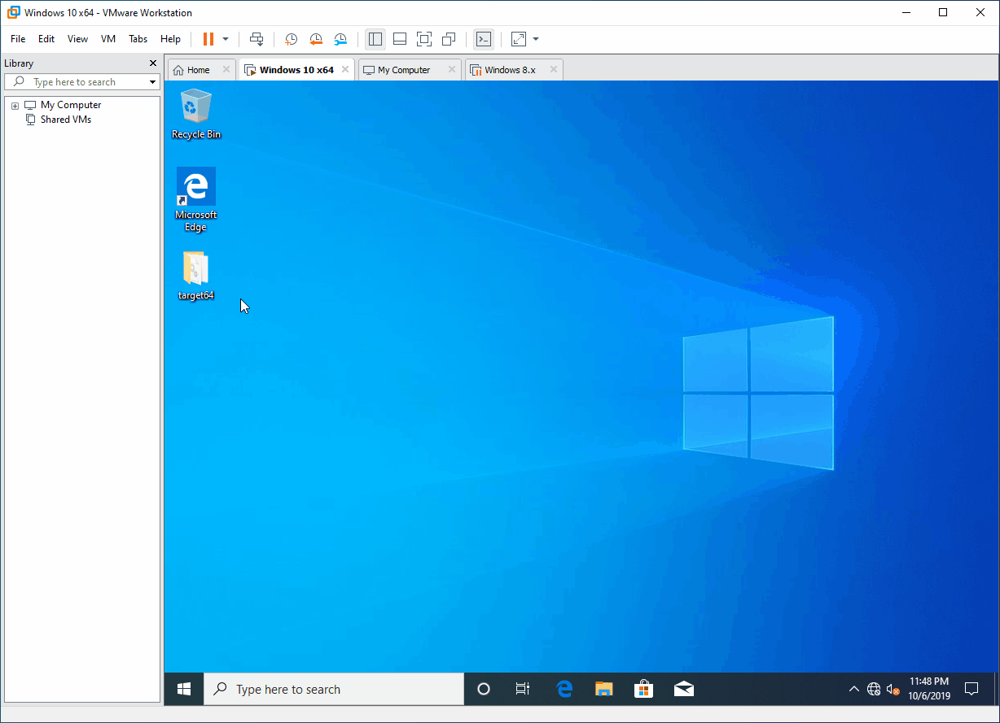
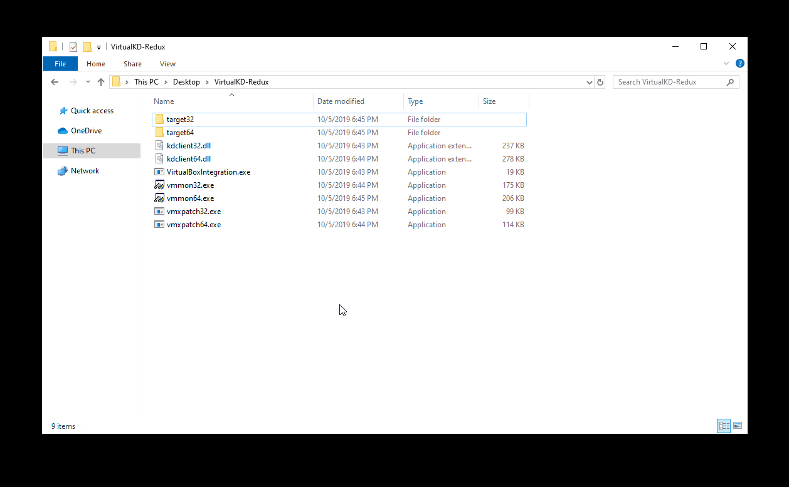

# VirtualKD-Redux Tutorial

## Guest VM

1. Copy the target folder to the guest VM running inside VMware Workstation. If the Guest VM is running a 32-bit OS, copy "target32". Otherwise, if it's running a 64-bit OS, then copy "target64" instead.

2. Run "vminstall.exe" in the guest VM. If using Windows 10, ensure that "Replace kdcom.dll" is checked. Once the installer is complete, allow the guest VM to restart.

3. At the boot manager prompt, ensure the "VKD-Redux" entry is selected then press F8 for advanced options.

4. Select "Disable Driver Signature Enforcement" and boot the OS.

:bulb: You can use virtual machine snapshots to avoid having to perform these steps every time. Once the final step is completed and the OS has successfully booted, make a snapshot that can later be restored. **It is important to note that if a newer version of VirtualKD-Redux is installed on the host, then the guest VM must also be updated and vice versa. It is strongly recommended to make a new snapshot after upgrading and rebooting the guest VM.**

## Host (VirtualBox ONLY)

If you are using VMware Workstation, skip to the "Final Steps" section.

The latest version of VirtualBox is hardened and requires kdclient to be signed and trusted. You must decide if you want to use the signed binaries included with VirtualKD-Redux. The alternative is to resign the binaries with your own certificates. If you want to use your own code signing certificates, sign the kdclient dlls and skip to step 2.

1. To use the included binaries with the VirtualKD-Redux release, import VKD-Redux_CA.cer into the **Trusted Root Certification Authorities** certificate store for **"Local Machine"** NOT "Current User".

2. Close VirtualBox if it is running. Run "VirtualBoxIntegration.exe" and click "Enable" for each virtual machine that you want to use VirtualKD-Redux with. Once completed, you can now run VirtualBox.

## Host (Final Steps)

1. If your host OS is a 64-bit machine run "vmmon64.exe". Otherwise, if it's running a 32-bit OS, instead run "vmmon32.exe".

2. If this is your first time running VirtualKD-Redux, ensure that the "Debugger path" is properly set. This can be the path to "windbg.exe" installed on your system.

3. Select the VM you want to attach to and then press "Run debugger".

4. Your debugger is now debugging the guest OS. To validate this, issue the break command to insert a breakpoint.
